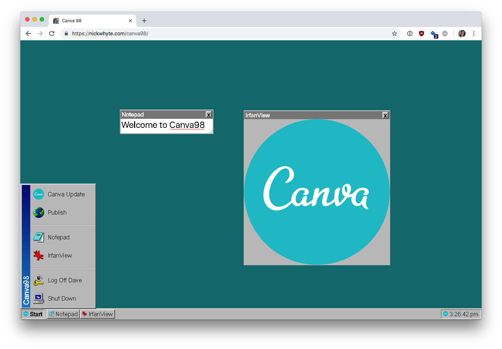

# Canva98

Canva in Windows 98 style (Canva 19日 code golf competition)

Supports the minimal feature set for the 19日:

* Add images to the canvas (done via IrfanView ✅)
* Add text to the canvas (done via Notepad ✅)
* Drag/move elements ✅
* Save the canvas as an image file (Thanks to [dom-to-image](https://github.com/tsayen/dom-to-image)) ✅

## Demo

